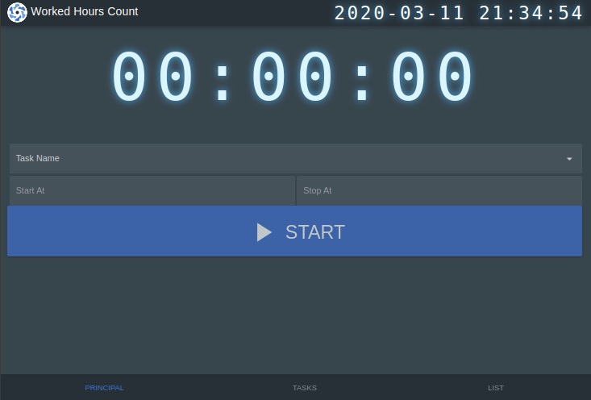
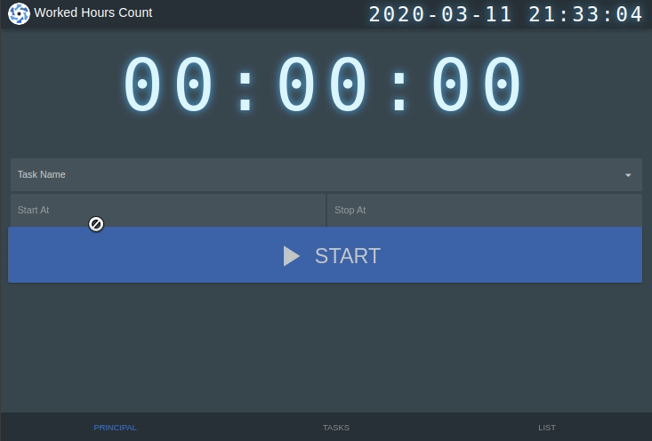
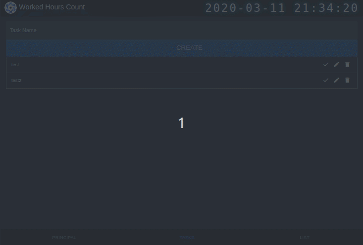
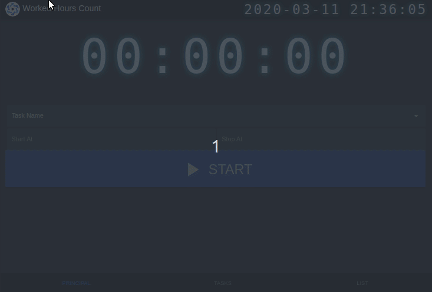

# WHC

An application to count the time in an activity  
<a href='https://github.com/shivamkapasia0' target="_blank"></a>
<a href='https://github.com/shivamkapasia0' target="_blank"></a>  

## Main features
### Run time!

### Tasks (TODO)

### Select only not done

### list and export to CSV/Excel


## Prerequisites
* [GIT](https://git-scm.com/)
* [YARN](https://yarnpkg.com/)

## Geting starter
Clone the repository
```
git clone https://github.com/EmersonBraun/WHC
```

## Install the dependencies
```bash
yarn
```

### Start the app in development mode (hot-code reloading, error reporting, etc.)
```bash
quasar dev
```

### Build the app for production
```bash
quasar build
```

### Customize the configuration
See [Configuring quasar.conf.js](https://quasar.dev/quasar-cli/quasar-conf-js).

## Build with
* [Quasar](https://quasar.dev/) - Build high-performance VueJS user interfaces in record time.
* [Vue](https://vuejs.org/) - The Progressive JavaScript Framework.
* [Dexie](https://dexie.org/) - Frontend DB

## Versioning

We use [SemVer](http://semver.org/) for versioning. For the versions available, see the [tags on this repository](https://github.com/EmersonBraun/WHC/tags). 

## Authores

* **Emerson Braun** - *Initial work* - [EmersonBraun](https://github.com/EmersonBraun)

See also the list of [contributors](https://github.com/EmersonBraun/WHC/contributors) who participated in this project.

## License

This project is licensed under the MIT License - see the [LICENSE.md](LICENSE.md) file for details